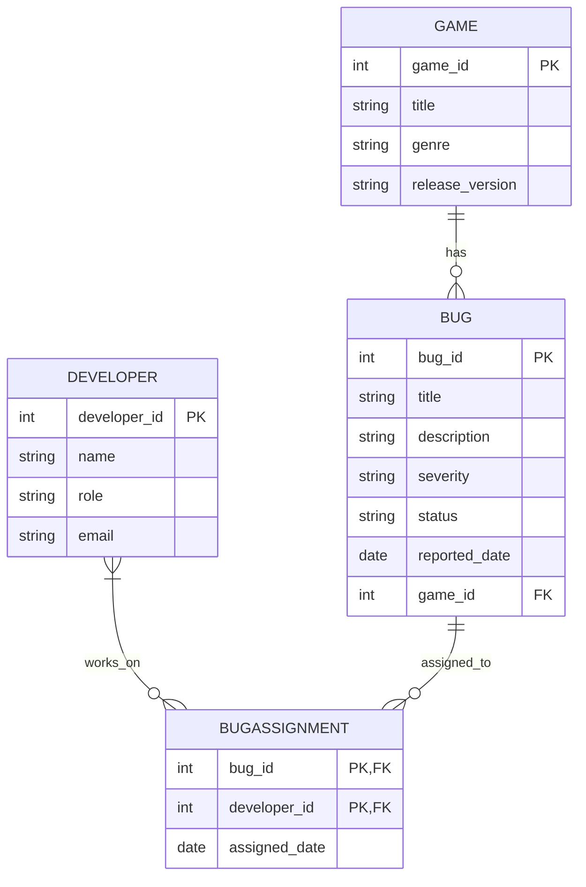

<style>
    body {
    font-family: Arial, sans-serif;
    line-height: 1.6;
    margin: 40px;
    padding: 20px;
    background-color: #f8f9fa;
    color: #333;
}

h1, h2, h3 {
    color:rgb(0, 0, 0);
}

h1 {
    text-align: center;
    font-size: 2em;
}

table {
    width: 100%;
    border-collapse: collapse;
    margin: 20px 0;
    background: white;
}

table, th, td {
    border: 1px solid #ddd;
}

th, td {
    padding: 12px;
    text-align: left;
}

th {
    background-color: #007bff;
    color: white;
}

pre {
    background: #272822;
    color: #f8f8f2;
    padding: 15px;
    border-radius: 5px;
    overflow-x: auto;
    font-family: "Courier New", monospace;
}

code {
    background:rgb(75, 73, 73);
    padding: 2px 5px;
    border-radius: 3px;
    font-family: "Courier New", monospace;
}

</style>

# Group 12 CA Stage 1

## **Bug Tracking & Issue Managment System** 

## 1. Problem Domain Description

Scenario:

Game developers work in teams to build and maintain video games. During development, testers and players report bugs that need to be tracked, assigned, and resolved. Without a proper system, developers struggle to prioritize and fix issues efficiently.

**Why a Database is Needed:**

- Keeps a structured record of reported bugs, their severity, and status.
- Ensures developers can be assigned to specific issues.
- Links bugs to different versions of a game.
- Helps track progress and resolution times.

**Business Rules:**

1. A **bug** must belong to one **game**.
2. A **bug** can be assigned to multiple **developers**, and a developer can work on multiple bugs (**Many-to-Many**).
3. A **bug** must have a status (e.g., Open, In Progress, Resolved).
4. A **game** can have many **bugs**, but each bug belongs to only one game (**One-to-Many**).
5. A **developer** can work on multiple **games**.
6. Each **bug** is reported on a specific game version.
---
## 2. Entity and Attribute Identification

| Entity | Attributes |
| ----------- | ----------- |
| Bug | `bug_id (PK)`, `title`, `description`, `severity (Low/Medium/High)`, `status (Open/In Pregress/Resolved)`, `Reported_date`, `game_id (FK)` |
| Game | `game_id (PK)`, `title`, `genre`, `release_version` |
| Developer | `developer_id (PK)`, `name`, `role (Programmer/QA/Desiger)`, `email`|
| BugAssignment (Junction Table) | `bug_id (PK, FK)`, `developer_id (PK/ FK)`, `assigned_date`|

**Relationships:**
1. One-to-Many (1:M) A game can have many Bugs, but each bug belongs to only one game.

2. Many-to-Many (M:N) A bug can be assigned to multiple developers, and each developer can work on multiple bugs (handled via `BugAssignment`).

## Entity-Relationship (ER) Diagram



```
    ```mermaid
        erDiagram
            GAME ||--o{ BUG : has
            DEVELOPER }|--o{ BUGASSIGNMENT : works_on
            BUG ||--o{ BUGASSIGNMENT : assigned_to

            GAME {
                int game_id PK
                string title
                string genre
                string release_version
            }
            
            BUG {
                int bug_id PK
                string title
                string description
                string severity
                string status
                date reported_date
                int game_id FK
            }

            DEVELOPER {
                int developer_id PK
                string name
                string role
                string email
            }

            BUGASSIGNMENT {
                int bug_id PK, FK
                int developer_id PK, FK
                date assigned_date
            }
    ```
```
