# Group 12 - Stage 3 Report  
**Database Systems 1 - DBMS I8Z01**  
**Submission Date:** 28/04/2025  
**Student Name:** Cole Cumiskey  
**Student ID:** D00281856

---

## Section 1: Final ER Diagram (Mermaid.js)

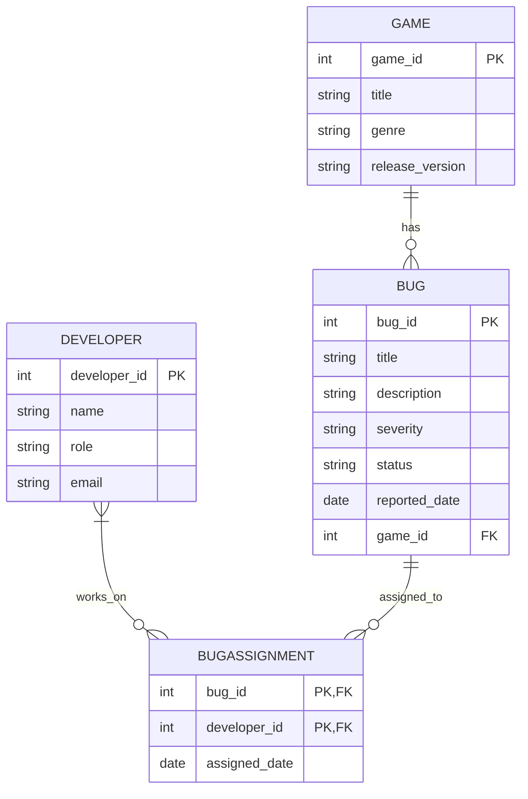

## Section 2: SQL Queries

### Query 1: List bugs and assigned developers
```SQL
SELECT b.bug_id, b.title, d.name
FROM bug b
JOIN bug_assignment ba ON b.bug_id = ba.bug_id
JOIN developer d ON ba.developer_id = d.developer_id;
```
#### Description:
Display each bug and the name of developers assigned to fix it.
#### Output:
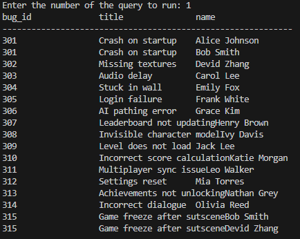

### Query 2: Count of bugs per game
```SQL
SELECT g.title, COUNT(b.bug_id)
FROM game g
JOIN bug b ON g.game_id = b.game_id
GROUP BY g.title;
```
#### Description:
Shows the number of bugs associated with each game.
#### Output:
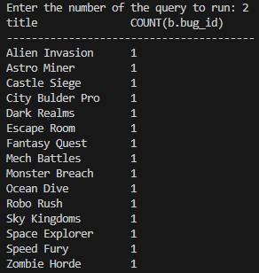

### Query 3: Count of bugs grouped by severity
```SQL
SELECT severity, COUNT(*) AS total
FROM bug
GROUP BY severity;
```
#### Description:
Aggregates bugs by severity level (Low, Medium, High).
#### Output:
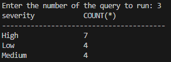

### Query 4: Developers assigned to the most recent bug
```SQL
SELECT d.name, b.title
FROM bug_assignment ba
JOIN developer d ON ba.developer_id = d.developer_id
JOIN bug b ON ba.bug_id = b.bug_id
WHERE b.reported_date = 
(
    SELECT MAX(reported_date) FROM bug
);
```
#### Description:
Lists developers assigned to the newest reported bug.
#### Output:
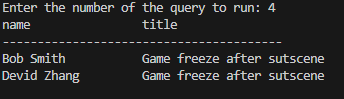

### Query 5: Show bugs with readable severity levels (CASE)
```SQL
SELECT title,
  CASE severity
    WHEN 'Low' THEN 'Minor'
    WHEN 'Medium' THEN 'Moderate'
    WHEN 'High' THEN 'Critical'
  END AS severity_level
FROM bug;
```
#### Description:
Translates severity into more descriptive terms using `CASE`.
#### Output:
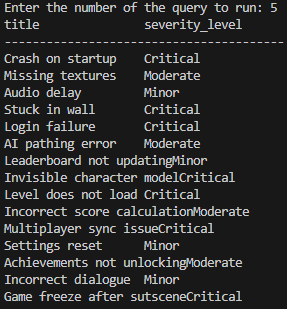

### Query 6: Bugs containing the word 'load' in the title
```SQL
SELECT * FROM bug
WHERE title LIKE '%load%';
```
#### Description:
Searches bug titles for the keyword "load".
#### Output:
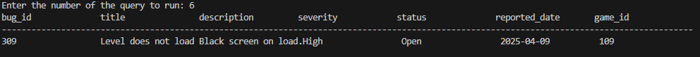

### Query 7: Count games with more than one bug (GROUP BY + HAVING)
```SQL
SELECT g.title AS game_title, COUNT(b.bug_id) AS bug_count
FROM game g
JOIN bug b ON g.game_id = b.game_id
GROUP BY g.title
HAVING COUNT(b.bug_id) > 1;
```
#### Description:
Filters to only show games that have more than one bug report.
#### Output:
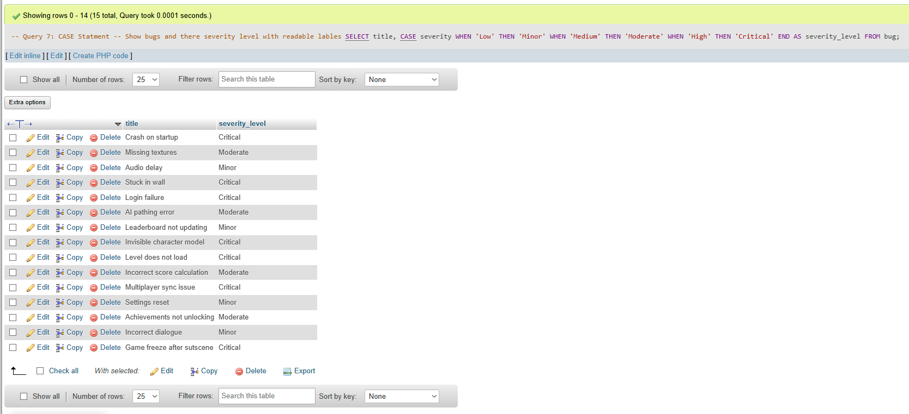

### Query 8: View bugs reported in the last 7 days (CTE)
```SQL
WITH RecentBugs AS 
(
  SELECT * FROM bug
  WHERE reported_date >= DATE('2025-04-08')
)
SELECT * FROM RecentBugs;
```
#### Description:
A CTE (Common Table Expression) used to isolate recent bug reports.
#### Output:
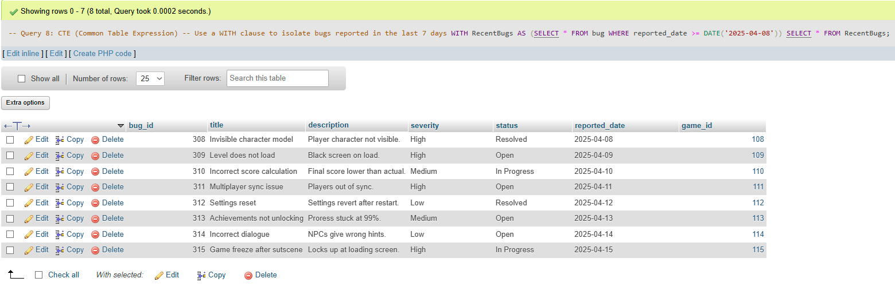

### Query 9: Create and use a view for bug details
```SQL
-- View creation (run once)
CREATE VIEW BugDetails AS
SELECT b.bug_id, b.title, g.title AS game_title, d.name AS developer_name
FROM bug b
JOIN game g ON b.game_id = g.game_id
JOIN bug_assignment ba ON b.bug_id = ba.bug_id
JOIN developer d ON ba.developer_id = d.developer_id;

-- Use the view
SELECT * FROM BugDetails;
```
#### Description:
View simplifies access to full bug details with game and developer info.
#### Output:
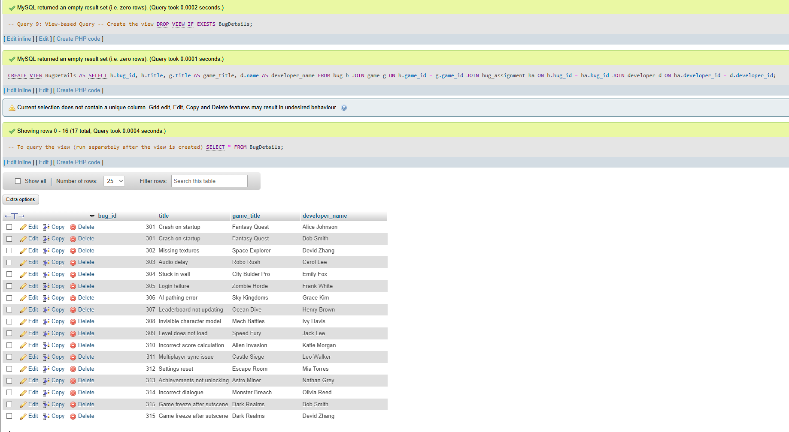

### Query 10: Subquery to show high-severity bugs only
```SQL
SELECT * FROM bug
WHERE severity = 'High'
AND bug_id IN 
(
    SELECT bug_id FROM bug WHERE severity = 'High'
);
```
#### Description:
Uses a subquery to filter for critical (high severity) bugs.
#### Output:
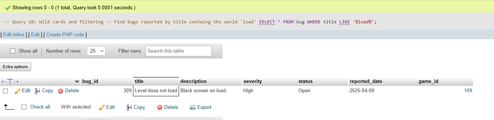

## Section 3: Individual Contribution
| Task / Component | Cole Cumiskey <br>
| SQL Schema Design (schema.sql) | Done<br>
| Sample Data Creation (populate.sql) | Done<br>
| SQL Query Development (queries.sql) | Done<br>
| SQLite Database Creation | Done<br>
| Java JDBC Application (Main, DB* classes) | Done<br>
| Java Query Execution | Done<br>
| Mermaid ER Diagram | Done<br>
| Markdown Report / PDF Compilation | Done<br>
| Screenshot Capture for Report | Done<br>
| Testing: PHPMyAdmin, DB Browser, Java | Done<br>
| ZIP Folder Preparation | Done<br>

## Section 4: Tools & References
### Tool / Technology | Purpose<br>
**Visual Studio Code** | Used as the main editor for writing SQL, Java, and Markdown<br>
**SQLite JDBC Driver** | Java library to connect to SQLite databases<br>
**DB Browser for SQLite** | Used to create, edit, and verify the final `database.sqlite` file<br>
**PHPMyAdmin (via XAMPP)** | Used for initial schema and query testing in MySQL<br>
**Mermaid.js** | Used to generate the ER diagram using Mermaid markdown syntax<br>
**Java SDK (OpenJDK 11)** | Compiling and running the Java application<br>
**Markdown PDF Exporter** | Used to convert the report from Markdown to PDF<br>

### Third-Party Content Declaration
As per Dkit policy, the following tools were used with transparency:<br>
**Stack Overflow** (referenced, Not copy-pasted)
Used fpr understading JDBC error messages and configuration examples. <br>
**Dkit Moodle** (Not copy-pasted)
Used for understanding how to use PHPmyAdmin and XAMPP

### References
- Elmasri & Navath (2015). Fundamentals of Database Systems (7th Ed.)
- GeeksforGeeks - SQL Normalization Articles
https://www.geeksforgeeks.org/normalization-in-dbms/
- SQLite JDBC Driver<br>
https://github.com/xerial/sqlite-jdbc
- Mermaid.js ER Diagram Documentation
https://mermaid.js.org/syntax/entityRelationshipDiagram.html