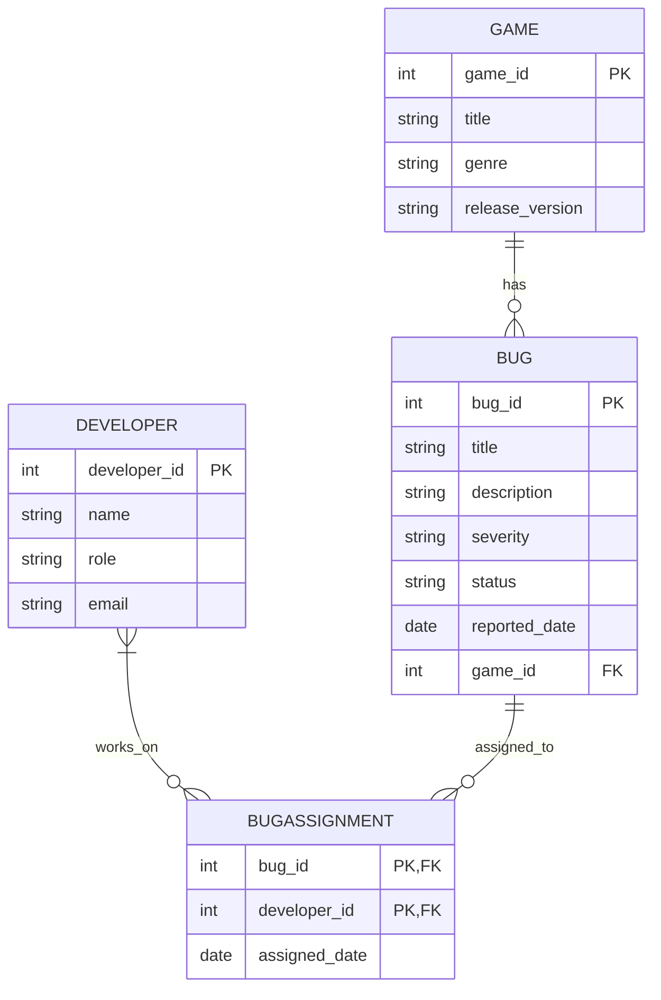

<style>
    body {
    font-family: Arial, sans-serif;
    line-height: 1.6;
    margin: 40px;
    padding: 20px;
    background-color: #f8f9fa;
    color: #333;
}

h1, h2, h3 {
    color:rgb(0, 0, 0);
}

h1 {
    text-align: center;
    font-size: 2em;
}

table {
    width: 100%;
    border-collapse: collapse;
    margin: 20px 0;
    background: white;
}

table, th, td {
    border: 1px solid #ddd;
}

th, td {
    padding: 12px;
    text-align: left;
}

th {
    background-color: #007bff;
    color: white;
}

pre {
    background: #272822;
    color: #f8f8f2;
    padding: 15px;
    border-radius: 5px;
    overflow-x: auto;
    font-family: "Courier New", monospace;
}

code {
    background:rgb(75, 73, 73);
    padding: 2px 5px;
    border-radius: 3px;
    font-family: "Courier New", monospace;
}

</style>

# Group 12 CA Stage 2

## **Problem Identification**

### **Scenario**
Game developers work in teams to build and maintain video games. During development, testers and players report bugs that need to be tracked, assigned, and resolved. Without a proper system, developers struggle to prioritize and fix issues efficiently.

### **Why a Database is Needed**
- Keeps a structured record of reported bugs, their severity, and status.
- Ensures developers can be assigned to specific issues.
- Links bugs to different versions of a game.
- Helps track progress and resolution times.

### **Business Rules**
- A bug must belong to one game.
- A bug can be assigned to multiple developers, and a developer can work on multiple bugs (Many-to-Many).
- A bug must have a status (e.g., Open, In Progress, Resolved).
- A game can have many bugs, but each bug belongs to only one game (One-to-Many).
- A developer can work on multiple games.
- Each bug is reported on a specific game version.

---

## Original ER Diagram/Unnormalized Form (UFN)
### ER Diagram


### Code for mermaid
```
    ```mermaid
        erDiagram
            GAME ||--o{ BUG : has
            DEVELOPER }|--o{ BUGASSIGNMENT : works_on
            BUG ||--o{ BUGASSIGNMENT : assigned_to

            GAME {
                int game_id PK
                string title
                string genre
                string release_version
            }
            
            BUG {
                int bug_id PK
                string title
                string description
                string severity
                string status
                date reported_date
                int game_id FK
            }

            DEVELOPER {
                int developer_id PK
                string name
                string role
                string email
            }

            BUGASSIGNMENT {
                int bug_id PK, FK
                int developer_id PK, FK
                date assigned_date
            }
    ```
```

### **Entities and Attributes**

**Bug**
```sql
+---------+----------------------+---------------------+------------+---------------------+---------+---------+
| bug_id  | title                | description         | severity  | status              | reported_date | game_id |
+---------+----------------------+---------------------+------------+---------------------+---------+---------+
| 1       | Game crashes on start | The game crashes... | High       | Open                | 2025-04-01   | 101     |
| 2       | Missing textures      | The textures for... | Medium     | In Progress         | 2025-04-02   | 102     |
+---------+----------------------+---------------------+------------+---------------------+---------+---------+
```

**Game**
```sql
+---------+----------------------+------------+-----------------+
| game_id | title                | genre      | release_version|
+---------+----------------------+------------+-----------------+
| 101     | Fantasy Quest        | RPG        | 1.0             |
| 102     | Space Explorer       | FPS        | 2.1             |
+---------+----------------------+------------+-----------------+
```

**Developer**
```sql
+--------------+---------------------+----------------+--------------------+
| developer_id | name                | role           | email              |
+--------------+---------------------+----------------+--------------------+
| 1001         | Alice Johnson       | Programmer     | alice@email.com    |
| 1002         | Bob Smith           | QA             | bob@email.com      |
+--------------+---------------------+----------------+--------------------+
```

**BugAssignment**
```sql
+---------+--------------+---------------------+
| bug_id  | developer_id | assigned_date       |
+---------+--------------+---------------------+
| 1       | 1001         | 2025-04-01          |
| 2       | 1002         | 2025-04-02          |
+---------+--------------+---------------------+
```

---

## Functional Dependencies (FDs)
- bug_id -> title, description, severity, status, reported_date, game_id
- game_id -> title, genre, release_version
- developer_id -> name, role, email
- bug_id, Developer_id -> assigned_date

---

## Condidate Keys, Primary Keys (PKs) and Foreign Keys (FKs)
- Candudate Keys:
    - `bug_id` is a condidate key for the `Bug` entity.
    - `game_id` is a candidate key for the `Game` entity.
    - `developer_id` is candidate key for the `Developer` entity.
    - Combination of `bug_id` and `developer_id` is a candidate key for `BugAssignment`.
- Primary Keys (PKs):
    - `bug_id` is the primary key for `Bug` table.
    - `game_id` is the primary key for the `Game` table.
    - `developer_id` is the primary key for the `Developer` table.
    - Combination of `bug_id` and `developer_id` is the primary key for `Bugassignment`.
- Foreign Keys (FKs);
    - `game_id` in the `Bug` table is a foreign key referencing `Game.game_id`.
    - `bug_id` and ` developer_id` in the `BugAssignment` table are foreign keys referencing `Bug.bug_id` and `Developer.developer_id`

---

## Normalization
### Conformance to 1NF
- All the entities appear to be in **First Normal Form (1NF)**, as each attribute is single values, and no tables have repeating groups.

### Conformance to 2NF

#### **Remove Partial Dependencies**
1. **Bug**:
    - Primary Key:`bug_id`
    - Non-key attributes: `title`, `description`, `severity`, `status`, `reported_date`, `game_id`.

        There is no partial dependencys in this table, all attributes are fully dependent on the primary key

2. **Game**:
    - Primary Key:`game_id`
    - Non-key attributes: `tital`, `genre`, `release_version`

        There is no partial dependencys in this table, all attributes are fully dependent on the primary key

3. **Developer**:
    - Primary Key:`developer_id`
    - Non-key attributes: `name`, `role`, `email`

        There is no partial dependencys in this table, all attributes are fully dependent on the primary key

    
2. **BugAssignment**:
    - multi Primary Key:`bug_id`, `developer_id`
    - Non-key attributes: `assigned_date`

        There is no partial dependencys in this table, all attributes are fully dependent on the primary key

### Confromance to 3NF

#### **Identifie transitive dependencies**
- **Bug**: All attributes depend on the primary key `bug_id`, so there are no transitive dependencies here.
- **Game**: All attributes depend on the primary key `game_id`, so there are no transitive dependencies here.
- **Developer**:All attributes depend on the primary key `developer_id`, so there are no transitive dependencies here.
- **BugAssognment**: The `assigned_data` depends on teh composite key (`bug_id`, `developer_id`), so no transitive dependencies here either.

at this stage, all relations are in 3NF because:
- Each non-prime attribute is fully functionally dependent on the primary key.
- There are no transitive dependencies.

My tables are now fully normalized in 3NF and the database design is really for implementation 

---

## Conclusion

Normalization significanyly improves the database structure by removing data redundancy and ensuring data integrity. Initially in the **Unnormalized Form (UFN)**, the data contained **repeating groups** and **Multivalued attributes**. Through **1NF** I eliminated these issues by restructuring data into single values.

In **2NF**, I removed **partial dependencies**, ensuring that all non-key attributes were fully dependent on the whole primary key. Finally in **3NF** I eliminated **transitive dependencies**, making the database, more efficient and reducing anomalies during updates, deletions and insertions.

**Key benifits of this normalization process**:
- **Eliminates Redundancy**, reducing data storage needs.
- **Enhances data ontegrity**, preventing inconsistancies.
- **Improves scalability**, making it easier to modify the tables in the future.
- **Optimizes query performance**, as queries now deal with properly structured tables.

Alternative approaches could involve **denormalization** in cases where performance is prioritized over strict normalization. However for bug tracking systems where **data consistency and integraty are critical**, a fully normalized 3NF design is the most appropriate of my scenario.

---

## Document Presentation & Formatting

Your document follows a structured and professional format using **Markdown and Mermaid.js** for database bisualization. The use of **tables, headings,SQL-like structures and ER diagrams** makes the report clear and conprehensive for someone reading my report. Proper indentation, consistent naming coventions and explanatory sections making the document